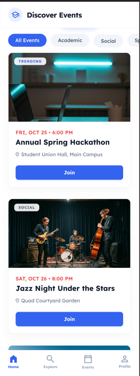
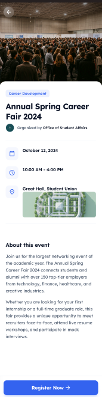
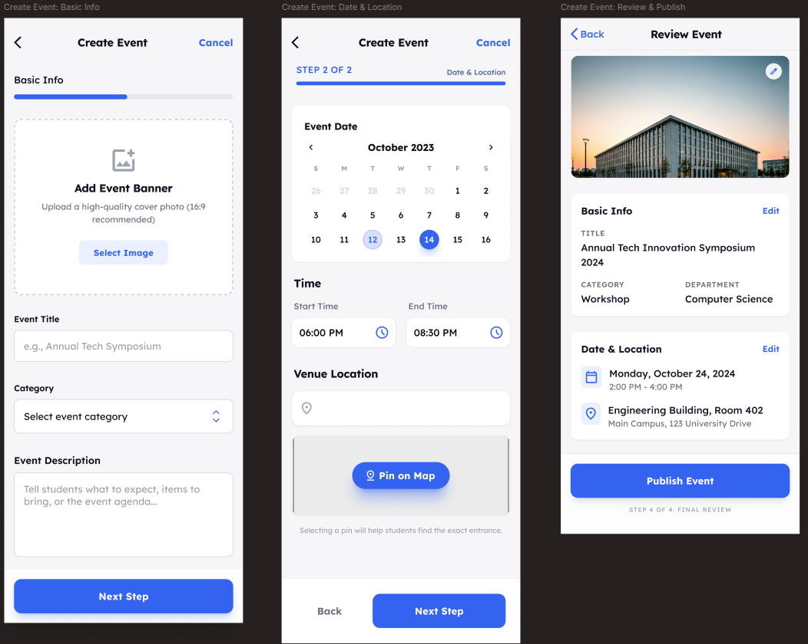
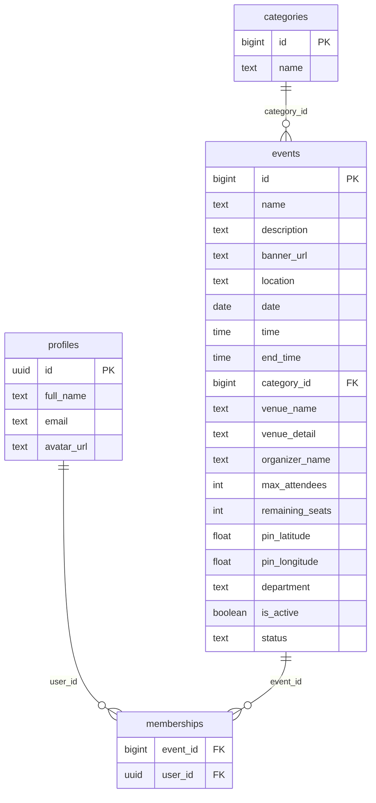

# EventBridge

**EventBridge** is a Kotlin Multiplatform mobile app that helps university students discover, create, and join campus events. Browse events by category, search with local history, register for events, and navigate to venues with an integrated map.


## Features

| Feature | Description                                                                    |
|---------|--------------------------------------------------------------------------------|
| **Event discovery** | Browse events on the home feed, filtered by category                           |
| **Search** | Full-text event search with persistent local search history (Room)             |
| **Event details** | View banners, schedule, venue, organizer, capacity, and attendee list          |
| **Join / leave** | Register for events and manage membership via Supabase                         |
| **Create events** | Multi-step wizard: basic info, location pin, banner upload to Supabase Storage |
| **My events** | View events the signed-in user has joined or created                           |
| **Map navigation** | Turn-by-turn route display using MapLibre and OpenRouteService                 |
| **Google sign-in** | Authenticate with Google ID token through Supabase Auth                        |
| **Profile** | View and update user profile stored in PostgreSQL (`profiles` table)           |

---

## Screenshots

### Home

Browse events by category, view upcoming listings, and open event details from the home feed.



### Event Details

View event banner, schedule, venue, organizer, capacity, and join or leave the event.



### Create Event

Multi-step wizard to publish a new campus event (basic info, location, and review — shown as three screens in one capture).



---

## Tech Stack

| Layer | Technology |
|-------|------------|
| **Language** | Kotlin 2.3 |
| **UI** | Compose Multiplatform 1.10, Material 3 |
| **Architecture** | Clean Architecture + MVVM |
| **DI** | Koin 4.1 |
| **Navigation** | Navigation Compose (multiplatform) |
| **Backend** | [Supabase](https://supabase.com) (PostgreSQL, Auth, Storage, PostgREST) |
| **Local DB** | Room 2.7 (search history) |
| **Networking** | Ktor 3.1, kotlinx.serialization |
| **Images** | Coil 3 |
| **Maps** | MapLibre Compose + OpenRouteService |
| **Auth** | Google Identity / Credential Manager (Android), Supabase Auth |
| **Logging** | Napier |
| **Targets** | Android (API 24+), iOS (Arm64 / Simulator Arm64) |

---

## Architecture Overview

EventBridge follows **Clean Architecture** with an **MVVM** presentation layer. Business rules live in the domain layer; the data layer implements repository contracts against Supabase, Room, and external APIs.

### Layer Responsibilities

| Layer | Responsibility | Key packages |
|-------|----------------|--------------|
| **Presentation** | Compose UI, `ViewModel`s, `UiState`, one-off `UiEffect`s | `presentation.*` |
| **Domain** | Entities, repository interfaces, domain models | `domain.*` |
| **Data** | Repository implementations, DTOs, mappers, local/remote sources | `data.*` |

### Design Patterns

- **Repository pattern** — `EventRepository`, `AuthRepository`, `ProfileRepository`, `SearchRepository`, and `LocationRepository` abstract data sources from the UI.
- **MVVM** — Each screen has a `ViewModel` extending `BaseViewModel<STATE, EFFECT>` with unidirectional state updates and side effects.
- **Dependency injection** — Koin modules (`dataModule`, `ViewModelModule`, `platformModule`) wire implementations at startup.
- **Mapper pattern** — DTOs (`EventDto`, `ProfileDto`) map to domain entities in `data.mapper`.

### Presentation Layer

- **Screens** — `HomeScreen`, `SearchScreen`, `EventsScreen`, `CreateEventScreen`, `EventDetailsScreen`, `MapNavigationScreen`, `ProfileScreen`, `LoginScreen`
- **State** — Immutable `*UiState` data classes per feature
- **Effects** — `*UIEffect` / `*Effect` for navigation, snackbars, and dialogs via `SharedFlow`

### Domain Layer

- **Entities** — `Event`, `Category`, `User`
- **Models** — `CreateEventDraft`, `MapRoute`, `Location`, `SearchHistoryItem`
- **Contracts** — Repository interfaces consumed only by presentation (and data implementations)

### Data Layer

| Component | Role |
|-----------|------|
| `SupabaseEventRepository` | Events, categories, search RPCs, memberships, banner upload |
| `SupabaseAuthRepository` | Google ID token sign-in, session observation |
| `SupabaseProfileRepository` | CRUD on `profiles` |
| `SearchRepositoryImpl` | Combines remote search + Room history |
| `LocationRepositoryImpl` | GPS via `PlatformLocationProvider`, routes via ORS |
| `SearchHistoryLocalDataSource` | Room DAO for recent queries |

### Dependency Injection

```text
initKoin()
 ├── dataModule          # repositories, HttpClient, Room
 ├── ViewModelModule     # all ViewModels
 └── platformModule      # Android-only: GoogleSignIn, FusedLocation (via EventBridgeApp)
```

---

## Project Structure

```text
EventBridge/
├── composeApp/                          
│   ├── src/
│   │   ├── commonMain/kotlin/com/uni/eventbridge/
│   │   │   ├── App.kt                   
│   │   │   ├── initKoin.kt
│   │   │   ├── data/
│   │   │   │   ├── local/               
│   │   │   │   ├── mapper/              
│   │   │   │   ├── remote/              
│   │   │   │   └── repository/          
│   │   │   ├── di/                      
│   │   │   ├── domain/
│   │   │   │   ├── entity/
│   │   │   │   ├── model/
│   │   │   │   └── repository/          
│   │   │   └── presentation/
│   │   │       ├── auth/
│   │   │       ├── common/              
│   │   │       ├── createEvent/
│   │   │       ├── eventDetails/
│   │   │       ├── events/
│   │   │       ├── home/
│   │   │       ├── map/
│   │   │       ├── navigation/          
│   │   │       ├── profile/
│   │   │       ├── search/
│   │   │       └── splashScreen/
│   │   ├── androidMain/                 
│   │   ├── iosMain/                     
│   │   └── commonTest/                  
│   └── schemas/                         
├── iosApp/                              
├── gradle/libs.versions.toml            
├── settings.gradle.kts
└── README.md
```

---
### Prerequisites

| Tool | Version |
|------|---------|
| JDK | 11+ |
| Android Studio | Ladybug or newer (with KMP plugin) |
| Xcode | 15+ (for iOS builds, macOS only) |
| Supabase project | PostgreSQL + Auth + Storage enabled |
| Google Cloud project | OAuth 2.0 client for Android (and iOS if applicable) |
| OpenRouteService | API key for driving directions |

### End-user flows

1. **Sign in** — Launch app → Splash checks session → Google sign-in if needed.
2. **Browse** — Home tab shows categories and events; tap a card for details.
3. **Search** — Explore tab searches events; recent queries are saved locally.
4. **Join** — On event details, tap join; membership is stored in Supabase.
5. **Create** — My Events tab → create flow → publish (banner uploaded to Storage).
6. **Navigate** — From event details, open map when coordinates are available.

### Bottom navigation

| Tab | Route | Screen |
|-----|-------|--------|
| Home | `home` | Category-filtered feed |
| Explore | `explore` | Search |
| My Events | `events` | Joined / created events |
| Account | `account` | Profile & sign out |

---

## API Documentation

The mobile client talks to **Supabase** (PostgREST + RPC + Storage), not a custom REST server.

### Supabase PostgREST tables

| Table | Operations |
|-------|------------|
| `events` | `INSERT` on create |
| `memberships` | `INSERT`, `DELETE`, `SELECT` for join/leave/status |
| `profiles` | `SELECT`, `UPDATE` for current user |

### Supabase RPC functions

| Function | Parameters | Returns |
|----------|------------|---------|
| `get_categories` | — | List of categories |
| `get_event_by_id` | `p_event_id` | Single event with relations |
| `get_events_by_category` | `p_category_id` (nullable) | Filtered events |
| `search_events` | `query` | Matching events |
| `get_my_events` | — (uses `auth.uid()`) | User's events |
| `get_event_attendees` | `p_event_id` | List of attendee profiles |

### Supabase Storage

| Bucket | Path pattern | Purpose |
|--------|--------------|---------|
| `event-banners` | `banners/{userId}/{timestamp}.jpg` | Event banner images |

### External APIs

| Service | Endpoint | Purpose |
|---------|----------|---------|
| OpenRouteService | `POST /v2/directions/driving-car` | Driving route polyline |

### Auth

- **Provider:** Google via ID token → `supabase.auth.signInWith(IDToken)`
- **Session:** Observed via `supabase.auth.sessionStatus`

---

## Database Design

### Remote (Supabase / PostgreSQL)

Logical schema inferred from DTOs and repository usage:


